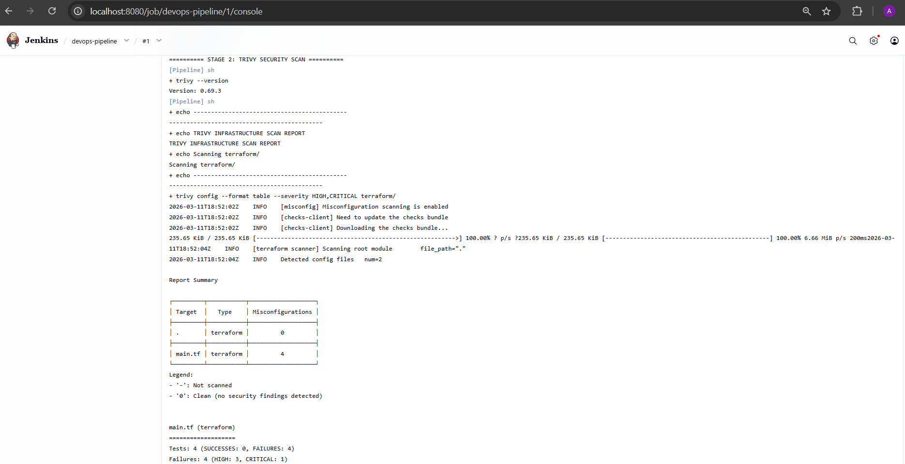
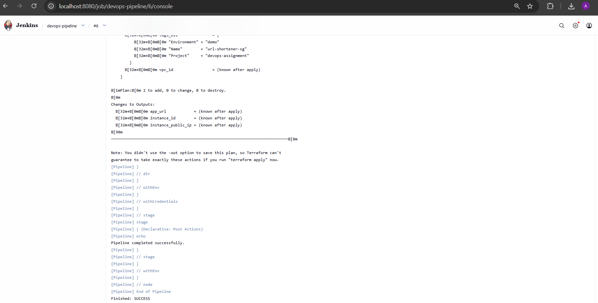
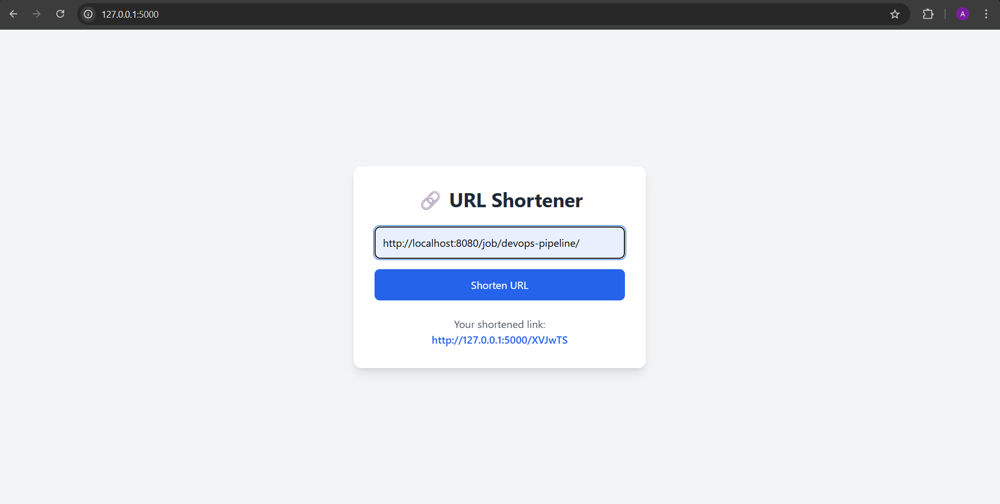

This project demonstrates a DevSecOps pipeline that integrates security scanning into the CI/CD workflow before infrastructure deployment.

## Architecture
GitHub → Jenkins Pipeline → Trivy Security Scan → Terraform Plan → AWS EC2

## The pipeline automatically:
-Pulls source code from GitHub
-Runs Trivy security scans on Terraform infrastructure code
-Blocks deployment if vulnerabilities are detected
-Runs Terraform plan to preview infrastructure changes

## Technologies Used
- Python (Flask)
- Docker
- Jenkins
- Terraform
- Trivy Security Scanner
- AWS EC2
- GitHub

## Jenkins Pipeline Stages:

Stage 1 — Checkout
The pipeline pulls the latest code from the GitHub repository.

Stage 2 — Infrastructure Security Scan
Trivy scans Terraform files for security misconfigurations such as:
-Unrestricted SSH access
-Unencrypted storage volumes
-Public network exposure
If HIGH or CRITICAL vulnerabilities are detected, the pipeline fails.

Stage 3 — Terraform Plan
If the security scan passes, Terraform generates a plan showing what infrastructure would be created.

## Screenshots

## Security Issues Identified and Fixed

Trivy detected several security vulnerabilities:

### Jenkins Pipeline Success

---

### Security Vulnerability Report

---

### Application Running on AWS EC2

## Security Issues Identified and Fixed

Trivy detected several security vulnerabilities:

## Watch the full demonstration here:
https://drive.google.com/your-video-link

## AI Prompt:
"I ran Trivy security scan on my Terraform code and got these findings.
Explain the security risks and rewrite the vulnerable sections to fix them."

## GenAI Usage Report

GenAI tools were used during development to assist with:

- Debugging Docker build issues
- Fixing Terraform security vulnerabilities detected by Trivy
- Designing the Jenkins pipeline stages
- Explaining AWS infrastructure misconfigurations
- Generating remediation strategies for security findings

Running the Project:

Build Jenkins Image:
docker build -t jenkins-custom ./jenkins

Run Jenkins:
docker run -d \
  --name jenkins \
  -p 8080:8080 \
  -p 50000:50000 \
  -v jenkins_home:/var/jenkins_home \
  jenkins-custom

Access Jenkins:
http://localhost:8080

To run the project:
docker compose up --build